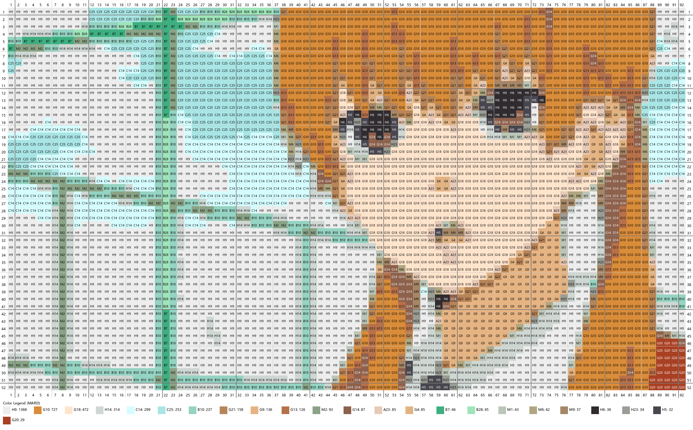

# ChromaBead

ChromaBead 是一个用于将普通图片转换为拼豆图纸的桌面工具。它支持图片导入、颜色聚类、MARD221 色卡映射，并输出适合拼豆制作的图纸与用量清单。

## 功能概览
- 支持拖拽或选择图片
- 可调节最大颜色数与图纸尺寸
- 使用 MARD221 色库进行颜色近似映射
- 自动生成拼豆图纸网格与色号标记
- 支持导出 PNG 图纸和颜色清单
- 基于 PyQt6 提供图形界面交互

## 项目结构
```text
ChromaBead/
├── main_gui.py          # GUI 主入口
├── bead_core.py         # 图纸渲染与图例绘制
├── color_processor.py   # 颜色处理、K-means 与 LAB 计算
├── mard221_data.py      # MARD221 色卡数据
├── requirements.txt     # 依赖清单
├── README.md            # 项目说明
├── .gitignore           # Git 忽略规则
├── app.log              # 运行日志（本地生成）
└── .venv/               # 可选虚拟环境目录
```

## 运行环境
- Python 3.8+
- PyQt6
- Pillow
- NumPy

## 安装依赖
```bash
pip install -r requirements.txt
```

## 运行方式
在项目根目录执行：
```bash
python main_gui.py
```

如果使用 Conda 环境，可先激活环境后再运行：
```bash
conda activate ChromaBead
python main_gui.py
```

## 处理流程
1. 读取并缩放输入图片
2. 将图像颜色转换为 LAB 空间
3. 使用自实现 K-means 聚类减少颜色数量
4. 将聚类中心映射到 MARD221 色库
5. 生成拼豆网格图纸与底部图例
6. 导出 PNG 图纸或数量统计文件

## 效果展示




## 许可证
本项目仅用于学习与个人创作用途。